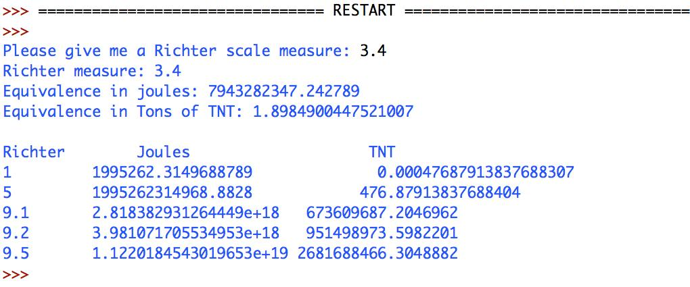

# 编程项目 #1

### 任务分配概览

第一次实验的作业是编写和测试一个基于“Hello World”程序，然后使用 *交卷* 程序去上交。

你随时可以使用*交卷*程序去交作业。请在实验室尝试着去提交“Hello World”程序（或者完整的工程），如果遇到问题，助教会帮你解决。
在实验室，你需要创建一个项目，当助教有空的时候你随时可以寻求帮助。
另外，还要提交题目（即使你没用做完，你可以以后重新提交）来让我们知道你能够提交题目。完成这个项目后再提交一次。

你写的第一个程序的需要实现以下功能：有提示信息，接收信息，然后处理信息，最后显示结果。

这个任务占10分（课程成绩的1%），必须在晚上一月14日周一晚11:59前完成。项目通常在周一完成。

### 背景

这个程序需要使用`input`，`print`和一些数学函数来处理数据。
这个任务的重要性在于你需要学会以下技能：访问课程网站，下载项目描述，用python创建一个新项目，最后再交上来。

### 里氏震级

里氏震级是用来描述地震级数的一种方法，它是一个以10为底的对数表。
（The magnitude is defined as the logarithm of the ratio of the amplitude of waves measured by a seismograph to an arbitrary small amplitude.未翻译）
里氏5.0级的地震震动幅度是4.0的10倍，能量是4.0的31.6倍。`[引用自维基百科]`

你需要根据里氏震级去计算一场地震释放的能量，你需要用两种方式完成：释放的焦耳（标准物理学表示能量的单位）数量，和它相当于多少TNT爆炸所释放的能量。最后，你需要列出一系列里氏级数和它们等价的能量。

### 公式

对于一个特定的里氏震级的焦耳能量计算方式是下面的公式：


能量的单位是焦耳，`richter`就是里氏震级（通常里氏震级是一个1-10之间的浮点数）

一吨TNT爆炸释放4.184×10E9焦耳能量，因此你能根据焦耳能量计算出相当于多杀吨TNT

### 程序描述

你的程序需要提示用户输入浮点数的里氏地震级数，你的程序需要输出以下信息：

- 用户输入的初始里氏震级
- 释放的能量，单位是焦耳，和用户输入的震级有关
- 等价能量相当于多少吨TNT爆炸

你的程序需要输出用焦耳和多少吨TNT两种方法表示以下震级：

- 1.0
- 5.0
- 9.1（2004年印度洋地震海啸）
- 9.2（1964年阿拉斯加大地震）
- 9.5（1960年智利地震，最大的地震）

你可以访问这个网站[http://www.convertalot.com/earthquake_power__calculator.html](http://www.convertalot.com/earthquake_power__calculator.html)去检查你的答案是否正确

### 上交要求

`proj01.py` -- 你的解答源代码（记得包含你的班级，日期，课程号和必要的注释）

1. 请务必使用这样的文件名字，例如：“proj01.py”
2. 在你的CSE账户磁盘里面做一次备份（CSE电脑磁盘的H盘）
3. 你需要使用提交程序上交一份电子版的拷贝，提交程序在这里：

[http://www.cse.msu.edu/handin/webclient](http://www.cse.msu.edu/handin/webclient)

### 任务说明

- 输入数据必须使用`input`函数，`input`函数包含一个用双引号引起来的字符串，作为对用户的提示信息。然后就是等待用户输入一些数据，用户输入回车键后就终止，然后就返回用户输入的字符串。
- 返回的字符串必须转换成数字。在这次任务中，我们严格使用浮点数进行计算，把一个字符串转换成浮点数需要使用`float`函数，`float`函数接收一个字符串作为参数并且其对应的浮点数。一个典型的交互程序看起来是这样的：

```python
num_str = input("请输入一个数字：")
num_float = float(num_str)
```

- `print`将一些变量，值和一些字符串的组合输出到输出窗口。将要输出的变量之间需要哦使用英文逗号进行分隔。所有的条目都将被一块输出，然后换到下一行。例如：

```python
bill_float = 123.456
print ("Number ",bill_float," times two:", bill_float*2)
```

- 这个命令有四个条目需要输出：一个字符串（"Number"）,`bill_float`(123.456)这个变量的值，另一个字符串（"times two"），表达式运算的结果（246.912）。它将输出：

```
Number 123.456 times two: 246.912
```

- 去231课程示例目录（`http://www.cse.msu.edu/~cse231/Examples/CoursePack/Python/`）看一下`numInput`程序，里面有使用`input`,`print`和`float`的示例程序（也包括用于整数的`int`）

- 一但将字符串转换成数字，对数字的操作包括：+（求和），-（减法），\*（乘法），/（除法），//（截断除法）和%（求余）

- 在python里面，不管数据类型是什么（整型或者浮点型），除法（/）的结果总是浮点型，例如：

```
>>> 3/4
0.75
```

- 计算一个数的阶乘的话，使用`**`运算符，例如：

`print("10 raised to the power 1.5 is ", 10**1.5)`

结果是：

`10 raised to the power 1.5 is 31.622776601683793`

- 要在python中使用科学计数法的话，按这样的格式写：`xey`，其中x和y表示一个数（浮点型或整型），如`4e5`就代表`4*10^5`

- python有很多方法让输出更美观，但是目前我们还没学，也不做要求，你可以使用输出一些空格（" "）的方法来进行简单的对齐，当然这需要一些尝试之后才能让输出看起来更漂亮


为了让题目更加清晰，我们在这个文档的结尾提供了一个我们已经写的程序的运行截图


### 入门指南

1. 使用`IDLE`创建一个新程序
2. 如果你在`CSE`实验室，选择`H:`盘去存储你的文件，并且当你离开的时候一定要退出登陆，否则下一个人坐在你的机器上可能会抄袭你的程序
3. 保存工程的文件名是：`proj01.py`
4. 使用`numberInput.py`里面提供的程序，写代码，追踪所有的错误（第一次不必全部找出来）
5. 运行程序
6. 使用提交网站去提交你的程序（确认你会提交）
7. 修改程序
8. 现在进入`修改-运行`这样一个圈去不断完善你的程序
9. 使用提交程序去提交你的最终版本

在规定的最后时间之前，务必确认你在你的`CSE`文件空间（实验室机器的H:盘）里面有你的完整的程序的拷贝。如果你你在家里写的程序并且在家里提交的，你需要在最后期限之前将程序拷贝到这里。万一电子设备出问题，在`CSE`磁盘上的文件是唯一可证明你完成的证据。

### 你需要考虑的问题（不提交）

1. 如果你输入了一个负数会怎样？
2. 在提示时你输入了一个字母而不是数字会出现什么情况？

### 简单交互


